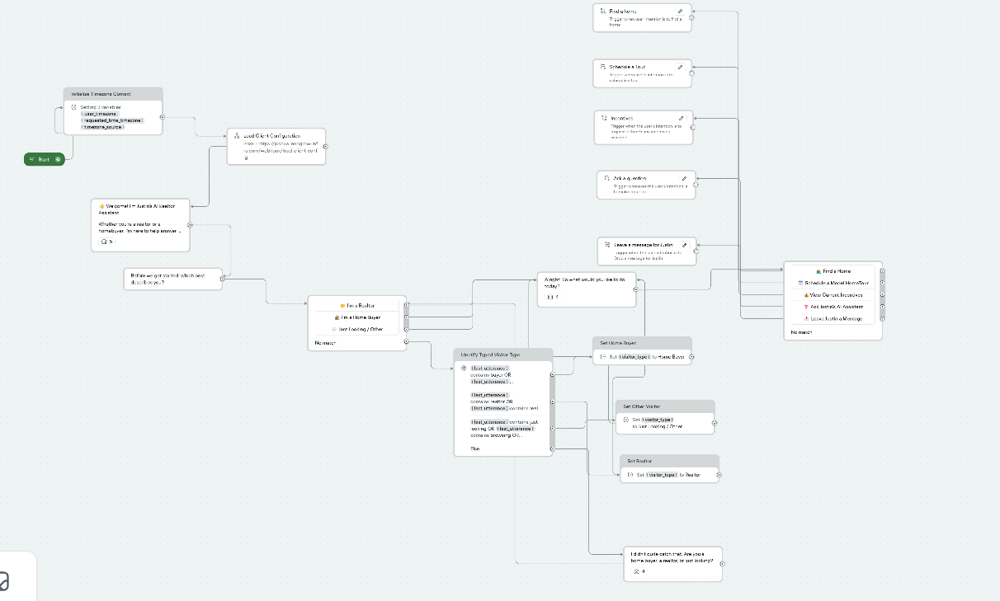

# AI Realtor Assistant — Justin Realty Demo

A working, deployment-ready real estate assistant built with **Voiceflow**, **n8n**, and **Google Sheets**.

The system helps prospective home buyers, realtors, and property visitors discover suitable homes, submit tour requests, ask about incentives, leave messages, request callbacks, and receive general real estate assistance.

> **Demo ownership:** This project is owned and built by Joshua Asegunloluwa Akanni. “Justin Realty” is a fictional demonstration business used to show how the system can be adapted for a real estate professional.

## Project Status

**Working deployment-ready demo**

The core Voiceflow conversations, n8n workflows, validation logic, timezone handling, UTC conversion, and Google Sheets storage are implemented. Before a commercial launch, a full regression test, production callback verification, webhook authentication, rate limiting, and live monitoring should be completed.

## What the Assistant Can Do

- Help visitors find suitable homes
- Collect model-home and property-tour requests
- Handle builder and property incentive inquiries
- Capture messages and callback requests
- Validate email formats
- Reject invalid or past date-and-time requests
- Convert local date and time values to UTC
- Store structured lead and request data
- Load reusable business configuration
- Route conversations naturally without exposing internal systems
- Avoid falsely claiming that a tour has been confirmed

## System Architecture

```text
Customer
   ↓
Voiceflow AI Assistant
   ↓
Intent and scenario routing
   ↓
Validation tools
   ↓
Voiceflow API request
   ↓
n8n webhook
   ↓
Data normalization and validation
   ↓
Google Sheets
```

## Core Workflows

### Voiceflow

The Voiceflow assistant manages:

- Welcome and intent routing
- Find a Home
- Schedule a Tour
- Incentive inquiries
- Contact and callback requests
- General real estate questions
- Email validation
- Date, time, and timezone validation
- User-facing confirmation messages

### n8n

The repository contains five sanitized n8n workflows:

| Workflow | Purpose |
|---|---|
| `load-client-configuration.json` | Loads business name, client ID, and business timezone |
| `find-a-home.json` | Normalizes and stores property-search interactions |
| `book-tour.json` | Validates and stores tour requests with UTC timestamps |
| `contact-request.json` | Validates and stores messages and callback requests |
| `incentive-request.json` | Normalizes and stores incentive inquiries |

## Important Business Rule

A submitted tour is treated as a **request**, not a confirmed booking.

The assistant tells the customer that the request has been received and that the realtor or sales team will review the preferred date and time before confirming availability.

## Repository Structure

```text
ai-realtor-assistant/
├── README.md
├── .env.example
├── .gitignore
├── docs/
│   ├── architecture.md
│   ├── project-journey.md
│   ├── testing-guide.md
│   └── screenshots/
├── voiceflow/
│   ├── ai-realtor-assistant.vf
│   └── README.md
├── n8n/
│   ├── load-client-configuration.json
│   ├── find-a-home.json
│   ├── book-tour.json
│   ├── contact-request.json
│   └── incentive-request.json
├── schemas/
│   ├── client-config-fields.md
│   ├── tour-request-fields.md
│   └── contact-request-fields.md
└── examples/
    ├── sample-tour-request.json
    ├── sample-contact-request.json
    ├── sample-home-search.json
    └── sample-incentive-request.json
```

## Setup

### 1. Import the Voiceflow project

Import:

```text
voiceflow/ai-realtor-assistant.vf
```

The public export uses placeholder webhook URLs such as:

```text
https://YOUR_N8N_DOMAIN/webhook/book-tour-demo
```

Replace `YOUR_N8N_DOMAIN` with your own n8n domain.

### 2. Import the n8n workflows

Import every JSON file inside the `n8n/` folder.

After import:

1. Connect your Google Sheets credential.
2. Replace `YOUR_GOOGLE_SHEET_ID`.
3. Confirm that the sheet tab names match the workflow configuration.
4. Review the webhook paths.
5. Test each workflow before activating it.

### 3. Create the Google Sheets tabs

Recommended tabs:

- `Client_Config`
- `Home_Search_Requests`
- `Tour_Requests`
- `Contact_Requests`
- `Incentive_Requests`

### 4. Configure the demo business

Example configuration:

```text
client_id: justin_demo
business_name: Justin Realty Demo
business_timezone: America/Chicago
```

Use valid IANA timezone names such as:

- `America/Chicago`
- `America/New_York`
- `Europe/London`
- `Africa/Lagos`

## Validation and Reliability

The system includes:

- Required-field cleaning
- Optional-field defaults
- Email syntax validation
- Phone-number preservation
- Preferred-contact-method validation
- IANA timezone validation
- Calendar-date validation
- 24-hour time validation
- Daylight-saving-aware UTC conversion
- Unique request ID generation
- Default request statuses
- Configurable submission timezones
- Alternative tour-time handling

## Testing

Test at least the following before deployment:

- Invalid and corrected email addresses
- Past and future preferred tour dates
- Optional alternative tour dates
- Phone-only contact requests
- Email-only contact requests
- Callback timezone and UTC storage
- Google Sheets column mapping
- Completed-conversation routing
- Failed webhook and spreadsheet responses

See `docs/testing-guide.md` for a practical checklist.

## Security

This public package has been sanitized. It does not include production credentials, private spreadsheet URLs, live webhook identifiers, customer records, or Voiceflow account metadata.

Never commit:

- n8n credentials
- Google service-account files
- Voiceflow API keys
- OAuth tokens
- Production webhook secrets
- Private spreadsheet links
- Customer personal information
- `.env` files

For commercial deployment, add:

- Webhook authentication
- Rate limiting
- Error monitoring
- Access controls
- Data-retention policies
- Duplicate-lead detection

## Planned Improvements

- Property inventory and listing integration
- Property cards and images
- CRM integration
- Email and SMS notifications
- Realtor dashboard reporting
- Duplicate-lead detection
- Request-status updates
- Follow-up automation
- Analytics and conversion tracking
- Conversation resume
- Stronger error logging

## Skills Demonstrated

- Conversational AI design
- Voiceflow development
- Prompt engineering
- Intent routing
- n8n workflow automation
- Webhook integration
- JavaScript data normalization
- Google Sheets automation
- Timezone and UTC handling
- Lead capture and qualification
- CRM-style data storage
- Production testing and error handling

## Author

**Joshua Asegunloluwa Akanni**  
AI Automation Specialist · n8n Workflow Developer · AI Agent Builder

GitHub: `github.com/joshuaakanni`  
Website: `blanyx.com`

## Usage

This repository is published as a portfolio and demonstration project. No open-source license is included. All rights remain with the project owner unless a license is added later.

## System Overview

The Voiceflow assistant routes visitors through property discovery, tour requests, incentive inquiries, general questions, and realtor contact workflows.


